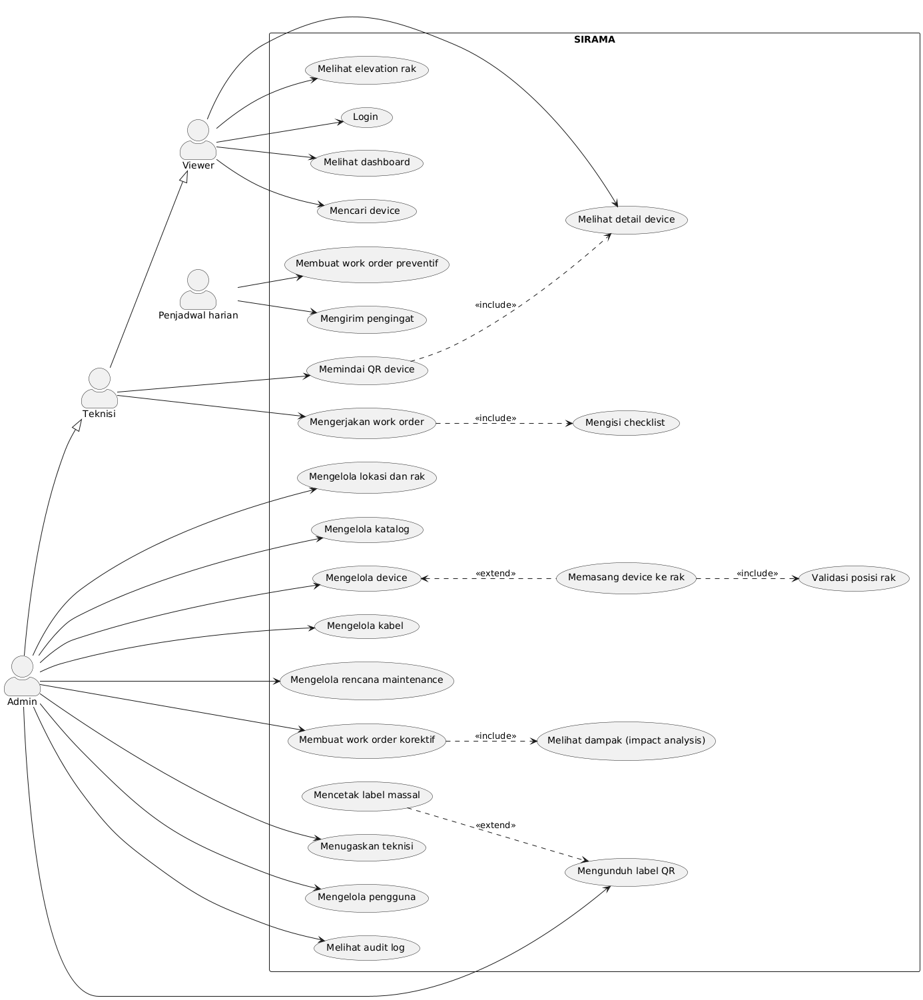

# Diagram Perancangan SIRAMA

| File | Isi | Deliverable |
|---|---|---|
| [`flowchart.md`](flowchart.md) | 6 flowchart alur sistem (Mermaid) | Use Case & Flowchart Sistem |
| [`use-case.puml`](use-case.puml) | Sumber diagram use case (PlantUML) | Use Case & Flowchart Sistem |
| [`use-case.png`](use-case.png) | Hasil render diagram use case | Laporan |
| `architecture.*` | Diagram arsitektur dan topologi | Dibuat bersama Technical Spec |

## Diagram use case

Panah generalisasi berarti Teknisi dapat melakukan semua yang dilakukan Viewer, dan Admin dapat melakukan semua yang dilakukan Teknisi, sesuai matriks hak akses di PRD.

## Merender ulang use case setelah diubah

GitHub tidak menampilkan PlantUML secara langsung, jadi gambar perlu dirender ulang setiap kali `use-case.puml` diubah. Pilih salah satu:
- Ekstensi PlantUML di VS Code (pratinjau dan ekspor PNG/SVG).
- Dengan Java: `java -jar plantuml.jar -tpng docs/diagrams/use-case.puml`.