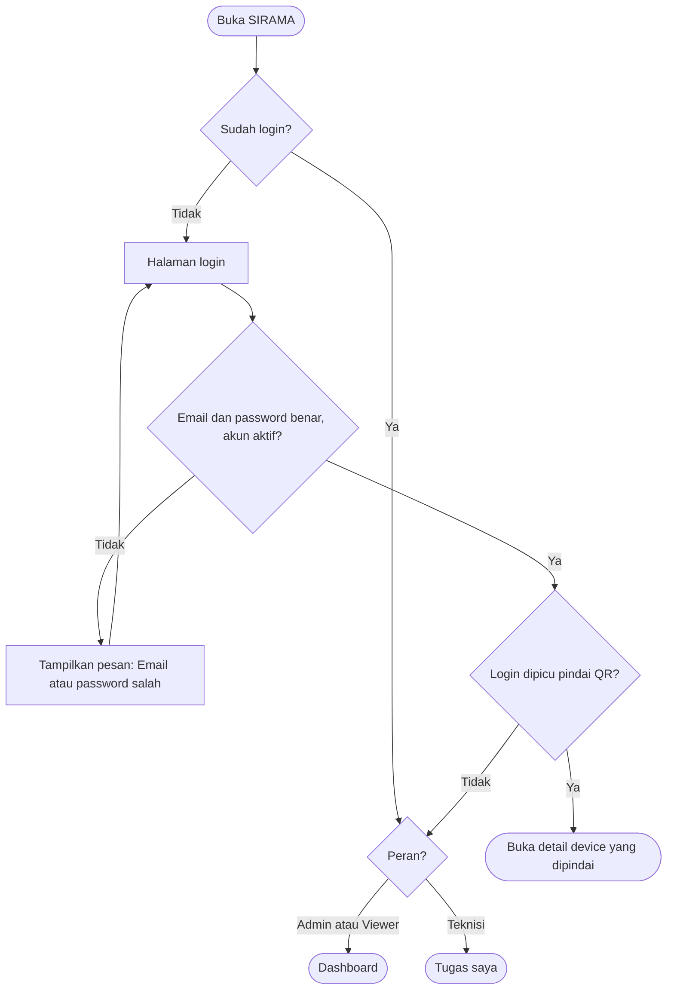
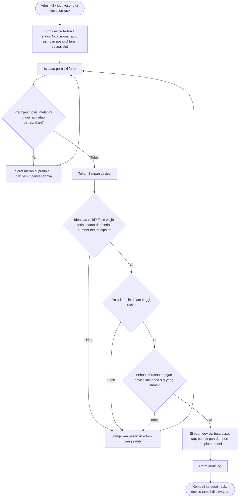
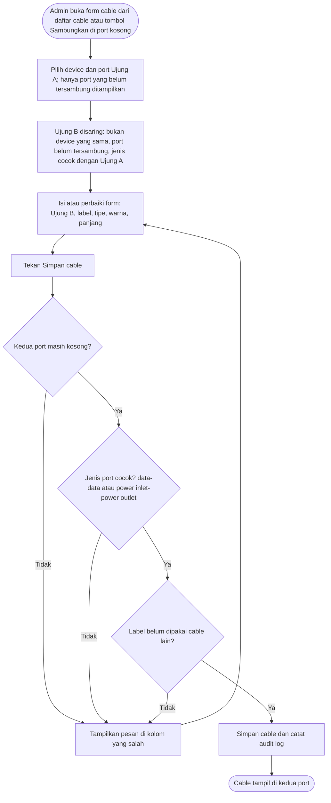
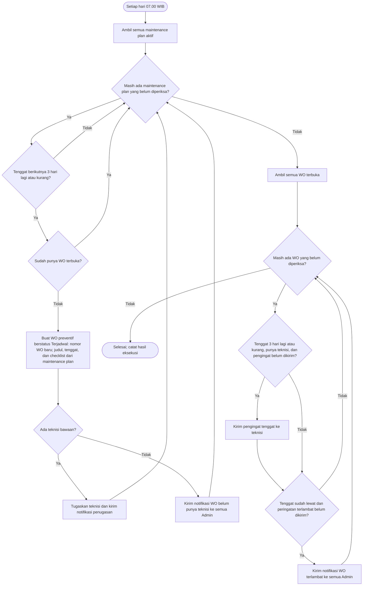
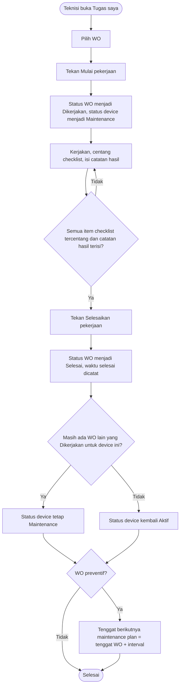
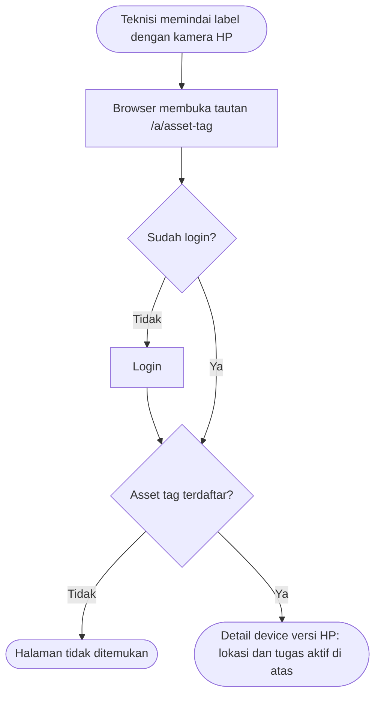

# Flowchart Sistem SIRAMA

Dokumen perancangan: **Flowchart Sistem** (deliverable mata kuliah).

Diturunkan dari [`specs/PRD.md`](../../specs/PRD.md) v0.3 dan [`specs/design.md`](../../specs/design.md) v0.3. Diagram ditulis dengan Mermaid sehingga tampil langsung di GitHub dan dapat direvisi sebagai teks. Untuk laporan, buka file ini di GitHub lalu ambil gambarnya, atau ekspor lewat [mermaid.live](https://mermaid.live).

| Kode | Alur | Aktor | Referensi PRD |
|---|---|---|---|
| F1 | Login dan pengalihan per peran | Semua | US-AUTH-01, US-QR-02 |
| F2 | Memasang device ke rack | Admin | US-DEV-01, US-DEV-02 |
| F3 | Menyambung cable | Admin | US-CAB-01 |
| F4 | Jadwal otomatis harian | Penjadwal harian (cron) | US-WO-01, US-NOTIF-01, US-NOTIF-02 |
| F5 | Mengerjakan work order | Teknisi | US-WO-04 |
| F6 | Memindai QR | Teknisi | US-QR-02 |

**Konvensi:** setiap belah ketupat menguji satu aturan dengan cabang Ya/Tidak. Semua penolakan pada form kembali ke satu langkah "Isi atau perbaiki form", karena form tetap terbuka dan user cukup memperbaiki kolom yang ditandai.

---

### F1. Login dan pengalihan per peran

---

### F2. Memasang device ke rack

Pemeriksaan posisi dilakukan dua kali: di pratinjau sebelum menyimpan (mencegah kesalahan) dan saat menyimpan (karena isi rack bisa berubah oleh user lain selama form terbuka).

---

### F3. Menyambung cable

---

### F4. Jadwal otomatis harian

Berjalan setiap hari pukul 07.00 WIB. Bagian pertama membuat WO preventif; bagian kedua mengirim pengingat dan peringatan. Setiap notifikasi dikirim sekali per WO, sehingga menjalankan ulang di hari yang sama tidak menghasilkan WO atau notifikasi ganda.

---

### F5. Mengerjakan work order

---

### F6. Memindai QR

