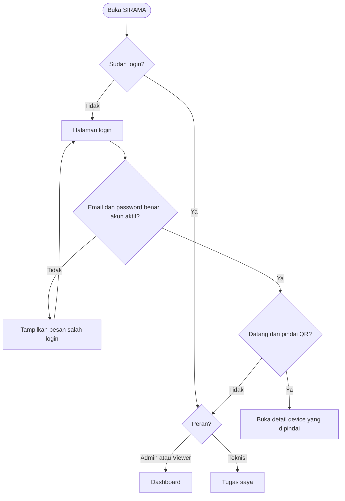
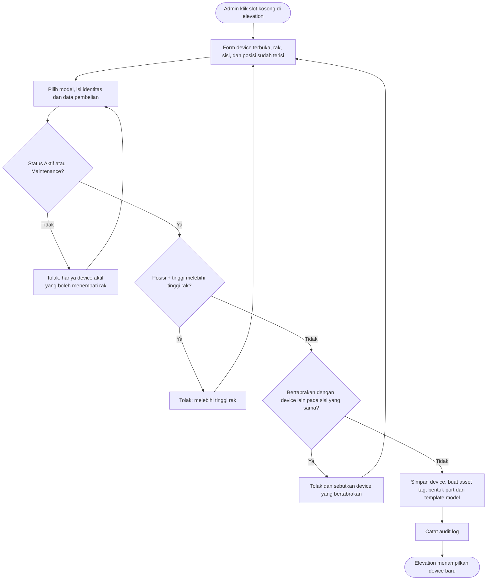
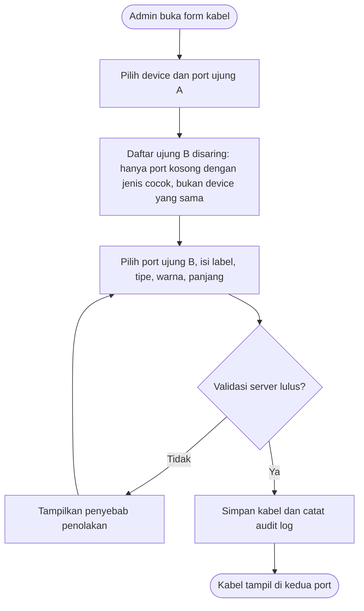
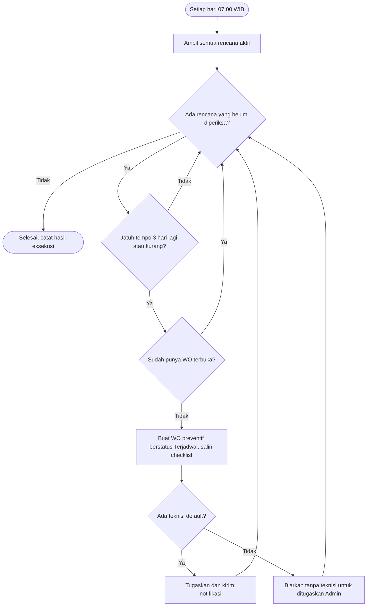
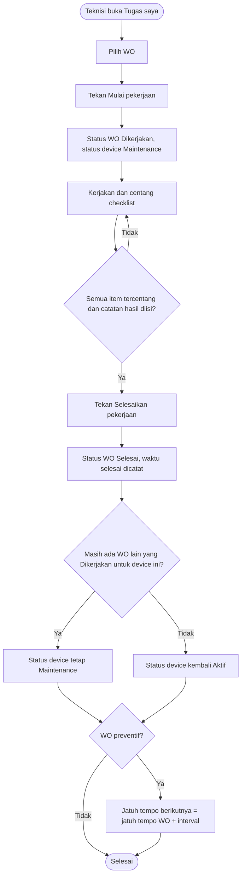
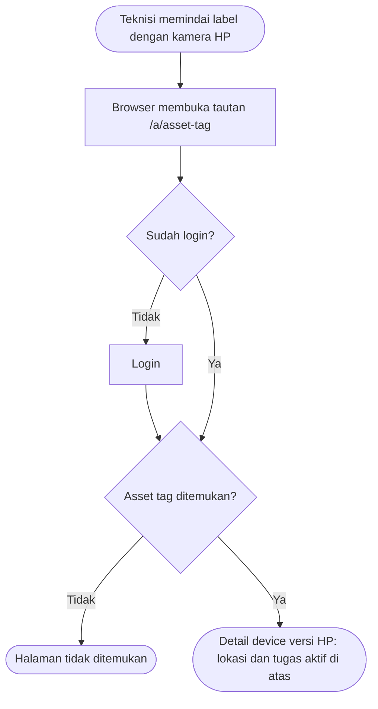

# Flowchart Sistem SIRAMA

Dokumen perancangan: **Flowchart Sistem** (deliverable mata kuliah).

Diturunkan dari [`specs/prd.md`](../../specs/prd.md) dan [`specs/design.md`](../../specs/design.md). Diagram ditulis dengan Mermaid sehingga tampil langsung di GitHub dan dapat direvisi sebagai teks. Untuk laporan, buka file ini di GitHub lalu ambil gambarnya, atau ekspor lewat [mermaid.live](https://mermaid.live).

| Kode | Alur | Aktor | Referensi PRD |
|---|---|---|---|
| F1 | Login dan pengalihan per peran | Semua | US-AUTH-01, US-QR-02 |
| F2 | Memasang device ke rak | Admin | US-DEV-02, US-DEV-03 |
| F3 | Menyambung kabel | Admin | US-CAB-01 |
| F4 | Pembuatan work order otomatis | Penjadwal harian (cron) | US-WO-01, US-NOTIF-01 |
| F5 | Mengerjakan work order | Teknisi | US-WO-04 |
| F6 | Memindai QR | Teknisi | US-QR-02 |

### F1. Login dan pengalihan per peran

### F2. Memasang device ke rak

### F3. Menyambung kabel

### F4. Pembuatan work order otomatis (cron harian)

### F5. Teknisi mengerjakan work order

### F6. Memindai QR

