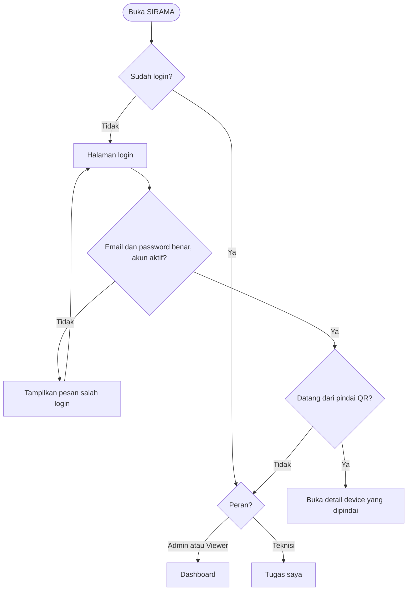
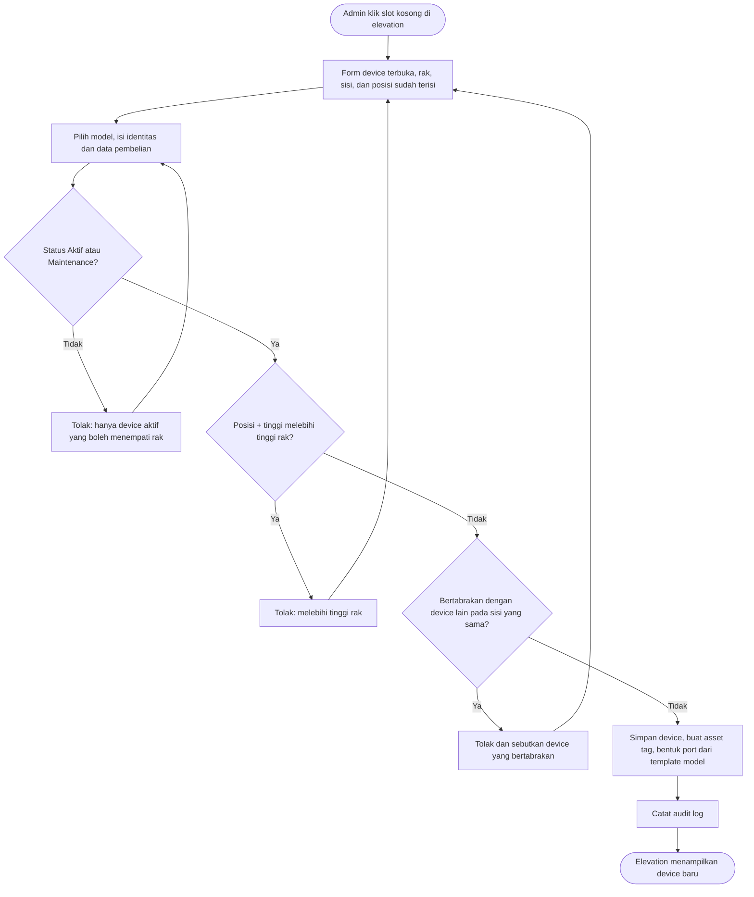
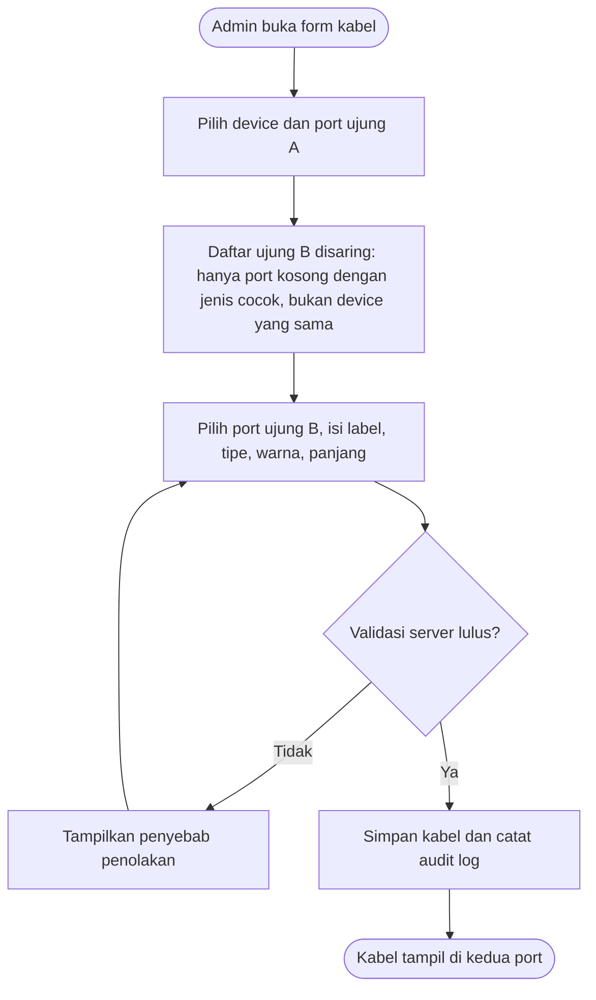
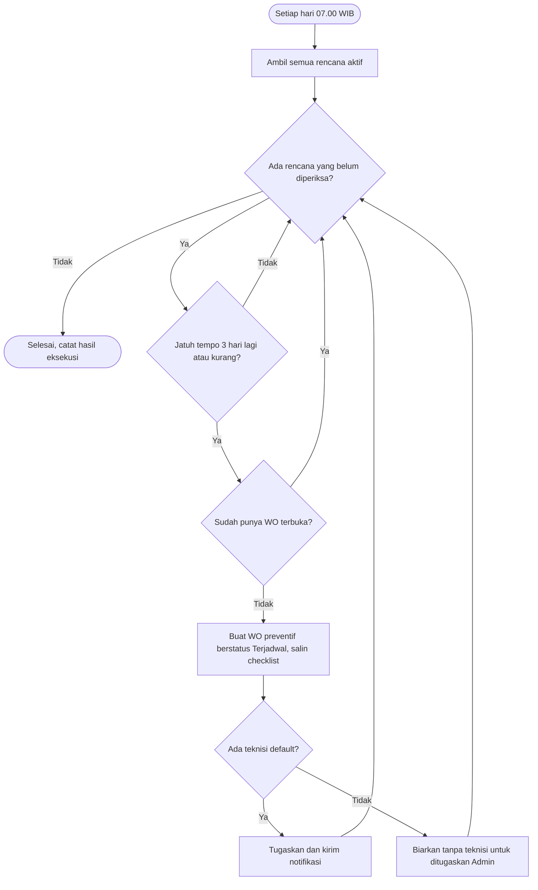
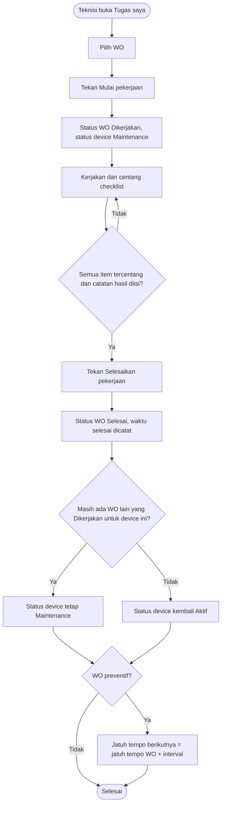
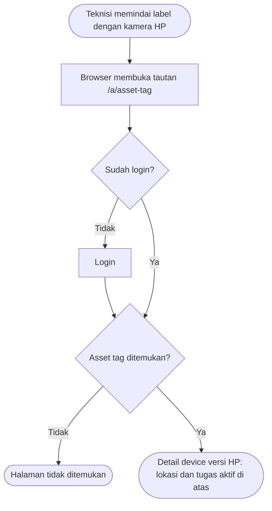
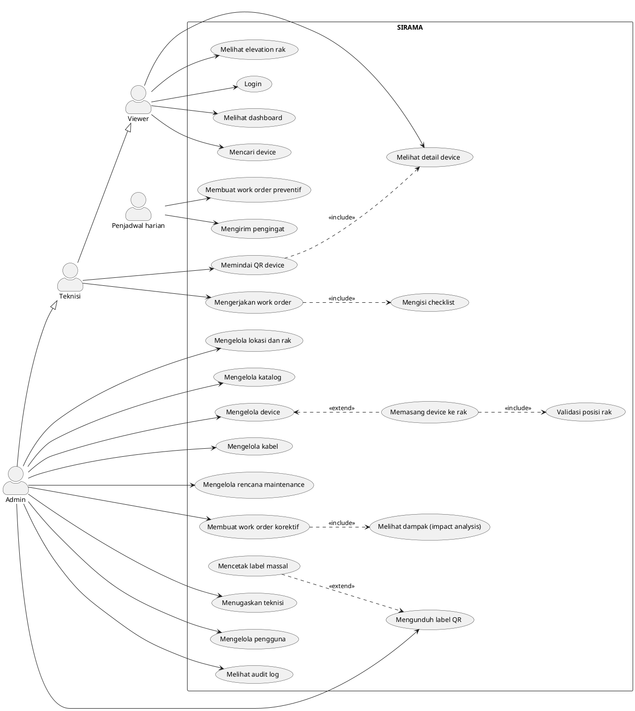

# Design Spec: SIRAMA

**SIRAMA** (Sistem Informasi Rak, Aset & Maintenance)

| | |
|---|---|
| Versi | 0.1 (draft, menunggu review) |
| Tanggal | 5 Oktober 2026 |
| Sumber | [`intent/asset-maintenance.md`](../intent/asset-maintenance.md), [`specs/prd.md`](prd.md) v0.2 |
| Tahap SDLC | Design |
| Dipakai oleh | Claude Design (mockup), Claude Code (build), tahap Test (acuan visual) |

Dokumen ini menjelaskan **bagaimana pengguna mengalami SIRAMA**: halaman apa saja, isinya apa, cara berpindah antarhalaman, dan aturan tampilannya. Kebutuhan fungsional ada di PRD; dokumen ini merujuknya dengan kode seperti `US-DEV-02`.

---

## 1. Prinsip desain

1. **Rak adalah pusatnya.** Elevation rak adalah elemen paling khas dan paling dipoles. Bagian lain dibuat tenang dan disiplin agar rak menonjol.
2. **Sekali lihat, langsung paham.** Jenis perangkat, kondisinya, dan sisa ruang terbaca tanpa membuka detail.
3. **Cegah di tampilan, tolak di server.** Pilihan yang tidak sah tidak ditampilkan (port terpakai, teknisi tidak sesuai keahlian). Server tetap menolak bila ada yang lolos.
4. **Lapangan dulu untuk teknisi.** Halaman yang dibuka teknisi di depan rak harus bisa dipakai dengan satu tangan di HP.
5. **Status tidak pernah hanya warna.** Setiap warna status selalu disertai teks atau ikon.

---

## 2. Identitas visual

### 2.1 Warna dasar

| Token | Hex | Peran |
|---|---|---|
| `ink` | `#14232B` | Teks utama (biru-abu sangat tua) |
| `ink-muted` | `#5A6B74` | Teks sekunder, keterangan |
| `surface` | `#FFFFFF` | Latar kartu, tabel, form |
| `canvas` | `#F3F6F8` | Latar halaman (abu dingin) |
| `line` | `#D5DEE3` | Garis tepi, pemisah |
| `air` | `#0A6C8C` | **Warna merek SIRAMA.** Tombol utama, menu aktif, tautan, fokus |
| `air-soft` | `#E1F1F6` | Latar menu aktif, sorotan lembut |

Aturan: `air` hanya dipakai untuk elemen yang **bisa diklik atau sedang aktif**, tidak untuk dekorasi dan tidak untuk status.

### 2.2 Warna status

Lencana status memakai warna pekat dengan teks dan ikon.

| Status | Hex | Dipakai untuk |
|---|---|---|
| Hijau | `#1E8E5A` | Device **Aktif**, WO **Selesai** |
| Kuning-oranye | `#B86E00` | Device **Maintenance**, WO **Dikerjakan**, garansi segera habis |
| Ungu-indigo | `#5B4FC4` | WO **Terjadwal** |
| Abu | `#6B7A83` | Device **Stok**, WO **Dibatalkan** |
| Abu tua | `#3D4950` | Device **Pensiun** |
| Merah | `#C2382F` | WO **Terlambat**, garansi habis, error |

### 2.3 Warna fungsi perangkat (khusus elevation rak)

Blok perangkat di elevation memakai **isian pucat + garis tepi kiri tebal** sesuai fungsi, supaya tidak tertukar dengan lencana status yang pekat.

| Fungsi | Isian | Garis kiri |
|---|---|---|
| Server | `#E4EEF7` | `#3B6E9E` |
| Switch / Router / Firewall | `#F4ECDD` | `#9A6A1F` |
| Storage | `#E6F2EC` | `#2F7A57` |
| Patch panel | `#EEEEF0` | `#6E6E78` |
| PDU / UPS (daya) | `#F7E6E3` | `#A4483C` |
| Lainnya | `#EDEFF1` | `#5A6B74` |

### 2.4 Tipografi

- **Satu keluarga huruf: IBM Plex Sans.** Bernuansa teknik dan infrastruktur, jelas di ukuran kecil, dan mendukung bahasa Indonesia.
- **Angka tabular** untuk nomor U, asset tag, serial number, dan tanggal agar sejajar di tabel dan elevation.
- Skala: 13 px (keterangan), 14 px (isi tabel), 16 px (teks utama), 20 px (judul bagian), 28 px (judul halaman).
- Teks memakai huruf kapital biasa di awal kalimat (*sentence case*), termasuk label dan tombol. Tidak memakai label huruf kapital semua.
- Panjang baris teks paragraf maksimal sekitar 75 karakter.

### 2.5 Bentuk dan kepadatan

- Sudut membulat kecil (4 px) untuk tombol dan input; 6 px untuk kartu. Elevation rak bersudut tegas (0-2 px), seperti rak sungguhan.
- Kepadatan sedang: tabel 44 px per baris di desktop agar banyak data muat tanpa sesak.
- Bayangan hanya untuk elemen yang melayang (modal, menu dropdown), bukan untuk setiap kartu.
- Animasi hanya sebagai respons aksi pengguna (modal terbuka, panel dampak muncul, status berubah). Tidak ada animasi dekoratif saat halaman dimuat.

### 2.6 Logo

Wordmark "SIRAMA" dengan IBM Plex Sans tebal berwarna `air`, disertai simbol sederhana yang menggabungkan bentuk rak (garis-garis horizontal bertumpuk) dan tetesan air. Dibuat di Claude Design.

---

## 3. Sitemap

```
/login
/                          → dialihkan sesuai peran (lihat 4.3)
/dashboard
/tugas                     → Tugas Saya (Teknisi)
/inventaris
  /lokasi                  → daftar site, ruangan, rak
  /rak/[id]                → detail rak + elevation
  /device                  → daftar device
  /device/baru
  /device/[id]             → detail device (tab)
  /device/[id]/ubah
  /kabel                   → daftar kabel
  /kabel/baru
/maintenance
  /work-order              → daftar WO
  /work-order/baru
  /work-order/[id]         → detail WO
  /rencana                 → daftar rencana
  /rencana/baru
  /rencana/[id]
  /kalender                → (Should)
/katalog
  /manufacturer
  /model
  /model/[id]              → detail model + template port
  /fungsi-perangkat
/admin
  /pengguna
  /audit-log
/notifikasi
/a/[asset-tag]             → tujuan QR, dialihkan ke /inventaris/device/[id]
/label/cetak               → cetak label massal (Should)
```

### Akses halaman per peran

| Halaman | Admin | Teknisi | Viewer |
|---|:---:|:---:|:---:|
| Dashboard, Inventaris, Maintenance, Katalog (lihat) | ✅ | ✅ | ✅ |
| Form tambah/ubah inventaris, katalog, rencana, WO baru | ✅ | ❌ | ❌ |
| Tugas Saya | ✅ | ✅ | ❌ |
| Admin (Pengguna, Audit Log) | ✅ | ❌ | ❌ |

Halaman yang tidak boleh diakses menampilkan halaman "Akses ditolak" dengan tautan kembali ke halaman awal peran tersebut.

---

## 4. Navigasi

### 4.1 Desktop: sidebar kiri

```
┌──────────────┬──────────────────────────────────────────────┐
│ ◈ SIRAMA     │ [ Cari nama, asset tag, serial...  ]  🔔3  Andi ▾│
│              ├──────────────────────────────────────────────┤
│ Dashboard    │                                              │
│ Tugas saya   │                                              │
│              │              (isi halaman)                   │
│ Inventaris   │                                              │
│   Lokasi & rak│                                             │
│   Device     │                                              │
│   Kabel      │                                              │
│ Maintenance  │                                              │
│   Work order │                                              │
│   Rencana    │                                              │
│   Kalender   │                                              │
│ Katalog      │                                              │
│ Administrasi │                                              │
│   Pengguna   │                                              │
│   Audit log  │                                              │
└──────────────┴──────────────────────────────────────────────┘
```

- Grup **Administrasi** hanya tampil untuk Admin. **Tugas saya** tidak tampil untuk Viewer.
- **Katalog** dibuat bisa dibuka-tutup dan tertutup secara bawaan, karena jarang dipakai setelah data awal terisi.
- Header berisi pencarian global (US-SRCH-01), lonceng notifikasi dengan jumlah belum dibaca (US-NOTIF-01), dan menu pengguna (profil, keluar).

### 4.2 HP: bar navigasi bawah

```
┌─────────────────────────────┐
│ ◈ SIRAMA            ☰       │  ← ☰ membuka menu lengkap
│                             │
│        (isi halaman)        │
│                             │
├──────┬──────┬──────┬────────┤
│  ▦   │  ☑   │  ⌕   │  🔔3   │
│ Dasbor│ Tugas│ Cari │ Notif  │
└──────┴──────┴──────┴────────┘
```

- Tombol **Tugas** tidak tampil untuk Viewer (bar berisi 3 tombol).
- Bar bawah memperhitungkan area aman layar (notch dan garis navigasi HP).

### 4.3 Halaman awal per peran

| Peran | Setelah login |
|---|---|
| Admin, Viewer | `/dashboard` |
| Teknisi | `/tugas` |

Bila login berasal dari pemindaian QR, pengguna dikembalikan ke halaman device yang dipindai (US-QR-02 AC2).

---

## 5. Pola antarmuka umum

### 5.1 Tabel daftar

- Pagination 25 baris per halaman, dengan total data ditampilkan.
- Kolom pencarian dan filter di atas tabel; filter yang aktif tampil sebagai "chip" yang bisa dihapus.
- Kolom status memakai lencana (bagian 2.2).
- Klik baris membuka halaman detail.
- Tabel yang mendukung aksi massal (device, untuk cetak label) memiliki kotak centang per baris.
- Di HP, tabel bisa digeser ke samping di dalam kotaknya sendiri; halaman tidak ikut bergeser.

### 5.2 Form

| Jenis data | Pola |
|---|---|
| Sederhana: manufacturer, fungsi perangkat, site, ruangan, rak | Modal |
| Kompleks: device, model + template port, kabel, rencana, WO, pengguna | Halaman penuh |

- Pesan validasi tampil di bawah kolom yang salah, berisi penyebab dan solusi. Contoh: *"Posisi U10-U11 bertabrakan dengan sw-tor-01. Pilih posisi lain."*
- Pilihan yang tidak sah tidak ditampilkan (lihat prinsip 3): daftar port hanya berisi port kosong dengan jenis yang cocok; daftar teknisi hanya berisi teknisi dengan keahlian yang sesuai (US-WO-03).
- Tombol utama menyebut aksinya secara jelas: "Simpan device", "Pasang ke rak", "Mulai pekerjaan". Tidak memakai "Submit" atau "OK".

### 5.3 Aksi berbahaya

Hapus, pensiunkan, batalkan WO, dan nonaktifkan pengguna selalu memakai dialog konfirmasi yang **menyebutkan dampaknya**. Contoh:

> **Pensiunkan srv-web-01?**
> Posisi U39-U40 di RK-A01 akan dikosongkan, 3 kabel dilepas, dan 1 rencana maintenance dinonaktifkan.
> [Batal] [Pensiunkan]

Membatalkan WO mewajibkan kolom alasan diisi.

### 5.4 Kondisi halaman

| Kondisi | Tampilan |
|---|---|
| Memuat | Kerangka abu-abu sesuai bentuk konten (bukan ikon berputar di tengah layar) |
| Kosong | Penjelasan singkat + tombol aksi pertama. Contoh: *"Belum ada rak di ruangan ini."* [Tambah rak] |
| Database masih kosong | Dashboard menampilkan langkah awal: tambah site → ruangan → rak → katalog → device |
| Error | Penyebab dan langkah perbaikan, tanpa permintaan maaf |
| Berhasil | Notifikasi singkat di pojok (toast) yang memakai kata kerja yang sama dengan tombolnya: "Simpan device" → "Device tersimpan" |

### 5.5 Format

- Tanggal: *5 Okt 2026*. Tanggal dan jam: *5 Okt 2026, 07.00 WIB*.
- Tanggal relatif hanya untuk notifikasi: *"3 jam lalu"*.
- Nomor U selalu diawali huruf U: *U12*, rentang *U12-U13*.

### 5.6 Teks antarmuka

- Bahasa Indonesia formal dan ringkas; istilah teknis tetap Inggris (rak, U, port, PDU, work order, asset tag).
- Menyebut hal dari sudut pandang pengguna: "Jadwal maintenance", bukan "Cron job".
- Satu aksi memakai satu nama di seluruh alur.

### 5.7 Aksesibilitas dasar

- Kontras teks minimal 4.5:1 terhadap latarnya.
- Semua aksi bisa dilakukan dengan keyboard; fokus terlihat jelas (garis `air`).
- Setiap tombol berikon memiliki label teks atau keterangan untuk pembaca layar.
- Menghormati pengaturan "kurangi gerakan" di perangkat pengguna.

---

## 6. Inventaris halaman

Setiap halaman: tujuan, isi, aksi, dan catatan khusus. Tanda 📱 = wajib dioptimalkan untuk HP (NFR-02).

### Login (`/login`)
- Logo, kolom email dan password, tombol "Masuk".
- Pesan salah login generik (US-AUTH-01 AC2). Tidak ada tautan daftar.

### Dashboard (`/dashboard`) 📱
- **Peta ruangan:** setiap rak digambar sebagai kolom vertikal kecil yang terisi sesuai pemakaian U, dengan warna fungsi perangkat. Ini versi mini dari elevation dan menjadi bagian paling khas di dashboard. Klik kolom membuka detail rak.
- **Perlu perhatian:** daftar WO terlambat (merah) dan WO jatuh tempo 7 hari ke depan.
- **Garansi:** device dengan garansi habis dalam 30 hari.
- **Ringkasan device per status:** satu baris ringkas, bukan deretan kartu angka besar.
- Di HP: Perlu perhatian tampil paling atas, lalu peta ruangan (bisa digeser ke samping), lalu sisanya.
- Referensi: US-DASH-01.

### Lokasi & rak (`/inventaris/lokasi`)
- Struktur bertingkat: site → ruangan → daftar rak dengan tinggi, U terpakai, dan persentase utilisasi.
- Admin: tambah/ubah site, ruangan, rak (modal).

### Detail rak (`/inventaris/rak/[id]`)
- Komponen elevation rak (bagian 7.1), sisi depan dan belakang berdampingan.
- Ringkasan: U terpakai, U kosong, persentase; daftar device 0U.
- Admin: klik slot kosong membuka form pasang device dengan rak, posisi, dan sisi sudah terisi.
- Referensi: US-RAK-02, US-DEV-02.

### Daftar device (`/inventaris/device`)
- Kolom: nama, asset tag, fungsi, model, lokasi (rak dan U), status, garansi.
- Filter: status, fungsi, rak, garansi.
- Aksi massal (Admin): cetak label (Should).

### Form device (`/inventaris/device/baru`, `/ubah`)
- Bagian 1, identitas: nama, model, fungsi perangkat, serial number, status.
- Bagian 2, penempatan: rak, sisi, posisi U. Menampilkan **pratinjau elevation mini** yang menyorot slot yang akan ditempati dan langsung berubah merah bila bertabrakan.
- Bagian 3, pembelian: tanggal beli, vendor, akhir garansi.
- Asset tag tampil sebagai teks tetap (tidak bisa diubah) pada mode ubah.
- Referensi: US-DEV-01, US-DEV-02.

### Detail device (`/inventaris/device/[id]`) 📱
**Desktop:** header (nama, asset tag, lencana status, tombol aksi Admin) + tab:

| Tab | Isi |
|---|---|
| Ringkasan | Lokasi lengkap dengan elevation mini, model, fungsi, serial, pembelian dan garansi, QR + tombol unduh label |
| Port & kabel | Tabel port: nama, jenis, tersambung ke (device dan port), label kabel. Panel perangkat terhubung (impact analysis) |
| Maintenance | Rencana aktif, WO terbuka, riwayat WO |
| Riwayat | Audit log device ini |

**HP:** tanpa tab. Urutan dari atas: header, **lokasi** (site, ruangan, rak, U, sisi), **tugas maintenance aktif** dengan tombol menuju WO, lalu bagian lain sebagai blok yang bisa dibuka-tutup.

Referensi: US-DEV-04, US-IMP-01, US-QR-01, US-QR-02, US-AUD-01 AC4.

### Daftar kabel (`/inventaris/kabel`) dan form kabel (`/inventaris/kabel/baru`)
- Daftar: label, tipe, warna (contoh warna kecil), ujung A, ujung B, panjang.
- Form: komponen pemilih port (bagian 7.5) untuk ujung A dan ujung B, lalu label, tipe, warna, panjang.
- Referensi: US-CAB-01, US-CAB-02.

### Daftar work order (`/maintenance/work-order`)
- Kolom: judul, device, jenis (Preventif/Korektif), teknisi, jatuh tempo, status (termasuk penanda Terlambat).
- Filter: status, jenis, teknisi, terlambat.
- Referensi: US-WO-05.

### Form work order (`/maintenance/work-order/baru`)
- Jenis Korektif (WO Preventif dibuat otomatis).
- Pilih device → **panel dampak** (bagian 7.2) langsung muncul di bawahnya.
- Deskripsi masalah, tanggal target, teknisi (sudah tersaring sesuai keahlian), checklist (opsional untuk Korektif).
- Referensi: US-WO-02, US-WO-03, US-IMP-02.

### Tugas saya (`/tugas`) 📱
- Daftar WO milik teknisi yang login, dikelompokkan: **Terlambat → Hari ini → Minggu ini → Nanti**.
- Setiap kartu: judul, device, lokasi singkat (*RK-A01 · U39*), jatuh tempo, status.
- Referensi: US-WO-05 AC3.

### Detail work order (`/maintenance/work-order/[id]`) 📱
- Info: judul, jenis, device (tautan), lokasi, teknisi, jatuh tempo, status.
- Panel dampak (ringkas).
- Komponen checklist (bagian 7.3).
- Tombol aksi sesuai status dan peran, menempel di bagian bawah layar HP: **Mulai pekerjaan** → **Selesaikan** (aktif setelah checklist lengkap dan catatan hasil diisi).
- Admin: Batalkan (dengan alasan), ubah teknisi.
- Referensi: US-WO-04.

### Rencana maintenance (`/maintenance/rencana`, `/baru`, `/[id]`)
- Daftar: judul, device, interval, jatuh tempo berikutnya, teknisi default, aktif/nonaktif.
- Form: judul, device, interval (angka + satuan), jatuh tempo pertama, teknisi default, editor checklist (tambah, hapus, urutkan item).
- Detail: info rencana + daftar WO yang pernah dihasilkan.
- Referensi: US-MP-01.

### Kalender (`/maintenance/kalender`) (Should)
- Tampilan bulanan; setiap WO tampil di tanggal jatuh temponya dengan warna status.
- Referensi: US-CAL-01.

### Katalog (`/katalog/...`)
- Manufacturer dan fungsi perangkat: tabel + modal. Fungsi perangkat menampilkan kategori (IT/Fasilitas) dan jumlah device yang memakainya.
- Model: tabel; detail model menampilkan spesifikasi dan **editor template port**.
- Referensi: US-CAT-01, US-CAT-02.

### Pengguna (`/admin/pengguna`)
- Tabel: nama, email, peran, keahlian, aktif/nonaktif. Form halaman penuh.
- Referensi: US-AUTH-02.

### Audit log (`/admin/audit-log`)
- Tabel: waktu, pengguna, aksi, objek. Klik baris membuka perbandingan data sebelum dan sesudah, dengan bagian yang berubah disorot.
- Filter: pengguna, jenis objek, rentang tanggal.
- Referensi: US-AUD-01.

### Notifikasi (`/notifikasi`)
- Daftar lengkap; yang belum dibaca ditandai. Tombol "Tandai semua sudah dibaca".
- Lonceng di header membuka dropdown 5 notifikasi terbaru.

### Cetak label (`/label/cetak`) (Should)
- Pratinjau lembar A4 berisi grid label 3 × 8 (24 label per lembar), lalu tombol cetak.
- Referensi: US-QR-03.

### Akses ditolak dan halaman tidak ditemukan
- Penjelasan singkat + tautan kembali ke halaman awal peran.

---

## 7. Komponen kunci

### 7.1 Elevation rak

```
 RK-A01 · 42U · 31U terpakai (74%)

        DEPAN                         BELAKANG
 U42 ┃                       ┃   ┃▌sw-tor-01      ● Aktif ┃
 U41 ┃ + Pasang di sini      ┃   ┃                        ┃
 U40 ┃▌srv-web-01            ┃   ┃▌srv-web-01             ┃
 U39 ┃▌      ◐ Maintenance   ┃   ┃▌                       ┃
 U38 ┃▌srv-db-01      ● Aktif┃   ┃▌srv-db-01              ┃
 U37 ┃▌                      ┃   ┃▌                       ┃
 ...
 U01 ┃                       ┃   ┃                        ┃

 Terpasang 0U: pdu-a-01 ● Aktif   pdu-b-01 ● Aktif
```

- Setiap U setinggi 22 px di desktop; nomor U di sisi kiri dengan angka tabular.
- Blok device memakai warna fungsi (bagian 2.3); tinggi blok sesuai jumlah U.
- Device full-depth tampil di kedua sisi. Di sisi kedua, blok diberi arsiran tipis sebagai tanda "bagian belakang dari device yang sama".
- Lencana status di dalam blok (warna + ikon + teks). Untuk blok 1U yang sempit, hanya ikon status dengan keterangan saat disorot.
- Arahkan kursor atau ketuk blok: tampil keterangan singkat (nama, model, asset tag, status). Klik membuka detail device.
- Slot kosong: untuk Admin tampil "+ Pasang di sini" saat disorot; untuk peran lain tampil kosong biasa.
- Di HP: kedua sisi tetap berdampingan dengan lebar lebih kecil; bila tidak muat, area elevation bisa digeser ke samping.

### 7.2 Panel dampak

Muncul langsung di form WO setelah device dipilih, juga di detail WO dan tab Port & kabel.

```
┌─ ⚠ 6 perangkat terhubung ke sw-tor-01 ──────────────────┐
│ Data (4)                                                 │
│   srv-web-01   port eth0 → sw-tor-01 port 1             │
│   srv-web-02   port eth0 → sw-tor-01 port 2             │
│   srv-db-01    port eth0 → sw-tor-01 port 3             │
│   core-sw-01   port 48   → sw-tor-01 port 48 (uplink)   │
│ Daya (2)                                                 │
│   pdu-a-01     outlet 7  → sw-tor-01 PSU1               │
│   pdu-b-01     outlet 7  → sw-tor-01 PSU2               │
└──────────────────────────────────────────────────────────┘
```

- Latar kuning-oranye pucat dengan ikon peringatan; tidak menghalangi penyimpanan.
- Bila tidak ada perangkat terhubung: panel abu-abu "Tidak ada perangkat terhubung."
- (Should, US-IMP-03) Untuk dampak daya, setiap perangkat diberi tanda **"Masih punya jalur daya cadangan"** atau **"Kehilangan seluruh daya"**.

### 7.3 Checklist work order

```
 Checklist (3 dari 5 selesai)
 ☑ Periksa panel indikator, pastikan tidak ada alarm
 ☑ Ukur tegangan setiap blok baterai
 ☑ Periksa fisik baterai
 ☐ Bersihkan debu pada ventilasi
 ☐ Jalankan self-test UPS

 Catatan hasil
 [                                              ]

 [        Selesaikan pekerjaan (belum aktif)       ]
```

- Hanya bisa dicentang saat status Dikerjakan dan oleh teknisi yang ditugaskan (atau Admin).
- Area sentuh setiap item minimal 44 px tinggi di HP.
- Tombol Selesaikan aktif setelah semua item dicentang dan catatan hasil diisi.

### 7.4 Label QR

```
┌──────────────────────────┐
│ ▓▓▓▓▓▓▓   DCM-0001       │
│ ▓ QR  ▓   srv-web-01     │
│ ▓▓▓▓▓▓▓   SIRAMA         │
└──────────────────────────┘
```

- Asset tag paling besar (dibaca manusia bila QR rusak), nama device lebih kecil, wordmark SIRAMA kecil.
- Hitam putih agar jelas di printer apa pun.
- QR berisi tautan `/a/[asset-tag]`.

### 7.5 Pemilih port

Dipakai di form kabel untuk ujung A dan ujung B.

```
 Ujung A
 Device   [ srv-web-03                     ▾ ]
 Port     [ eth0 · data · RJ45 (kosong)    ▾ ]
           ├ eth0 · data · RJ45
           ├ eth1 · data · RJ45
           └ (eth2, PSU1 tidak ditampilkan: sudah tersambung)
```

- Setelah ujung A dipilih, daftar port ujung B hanya menampilkan port **kosong dengan jenis yang cocok** (data ↔ data, power inlet ↔ power outlet), dan device yang sama tidak bisa dipilih.
- Di bawah daftar tertulis berapa port yang disembunyikan dan alasannya, agar pengguna tidak bingung.

---

## 8. Alur pengguna

Diagram berikut juga menjadi bahan **flowchart** untuk laporan.

### F1. Login dan pengalihan per peran



### F2. Memasang device ke rak



### F3. Menyambung kabel



### F4. Pembuatan work order otomatis (cron harian)



### F5. Teknisi mengerjakan work order



### F6. Memindai QR



---

## 9. Diagram use case

Sumber PlantUML. GitHub tidak menampilkannya secara langsung; diekspor menjadi gambar untuk laporan (lihat Tech Spec untuk cara ekspor).



Catatan notasi: panah generalisasi (`--|>`) berarti Teknisi dapat melakukan semua yang dilakukan Viewer, dan Admin dapat melakukan semua yang dilakukan Teknisi (sesuai matriks akses di PRD).

---

## 10. Naskah demo (draf, sekitar 7 menit)

Data seed diatur agar setiap adegan berjalan sesuai naskah (PRD Lampiran A).

| No | Adegan | Perangkat | Yang diperlihatkan | Referensi |
|---|---|---|---|---|
| 1 | Login sebagai Admin → dashboard | Laptop | Peta ruangan, 1 WO terlambat, 1 garansi hampir habis | US-DASH-01 |
| 2 | Buka RK-A02 → klik slot kosong → pasang server 2U di posisi yang bentrok | Laptop | Pratinjau merah dan penolakan yang menyebut device bentrok | US-DEV-02 |
| 3 | Pindah ke posisi kosong → simpan | Laptop | Device muncul di elevation, asset tag terbentuk | US-DEV-01 |
| 4 | Buat WO korektif untuk sw-tor-02 | Laptop | Panel dampak menampilkan server terdampak; daftar teknisi tersaring | US-IMP-02, US-WO-03 |
| 5 | Login sebagai Teknisi di HP | HP | Langsung mendarat di Tugas saya | Bagian 4.3 |
| 6 | Pindai label QR yang sudah dicetak dan ditempel | HP | Detail device versi HP terbuka | US-QR-02 |
| 7 | Mulai pekerjaan → kembali ke laptop | HP + laptop | Status device berubah menjadi Maintenance di elevation | US-WO-04 |
| 8 | Centang checklist → selesaikan | HP | Device kembali Aktif | US-WO-04 |
| 9 | Admin buka audit log | Laptop | Semua langkah di atas tercatat dengan data sebelum dan sesudah | US-AUD-01 |

Halaman yang paling dipoles berdasarkan naskah ini: detail rak, dashboard, form WO, Tugas saya, detail WO, dan detail device versi HP.

---

## 11. Brief untuk Claude Design

Lampirkan `intent/asset-maintenance.md`, `specs/prd.md`, dan dokumen ini, lalu gunakan prompt berikut:

```
Buat mockup aplikasi web SIRAMA (Sistem Informasi Rak, Aset & Maintenance)
berdasarkan design.md terlampir. Ikuti identitas visual di bagian 2 secara
persis: warna, tipografi IBM Plex Sans, warna status, dan warna fungsi
perangkat. Antarmuka berbahasa Indonesia dengan istilah teknis bahasa Inggris.
Gunakan data realistis dari ruang server kampus (lihat PRD Lampiran A).

Buat layar berikut secara berurutan:
1. Detail rak dengan elevation depan dan belakang (desktop) — bagian 7.1
2. Dashboard (desktop dan HP) — bagian 6
3. Detail device: tab Ringkasan (desktop) dan versi HP — bagian 6
4. Form work order dengan panel dampak (desktop) — bagian 6 dan 7.2
5. Tugas saya dan detail work order dengan checklist (HP) — bagian 6 dan 7.3
6. Login (desktop dan HP)
7. Lembar cetak label QR A4 — bagian 7.4

Elevation rak adalah elemen paling khas; buat paling detail. Elemen lain
tenang dan rapi. Status selalu memakai warna + ikon + teks.
```

Iterasi mockup sampai disetujui, lalu ekspor ke Claude Code. Mockup yang disetujui menjadi acuan perbandingan screenshot di tahap Test.

---

## 12. Ditunda ke Technical Spec

- Library komponen UI, library ikon, library autentikasi, library QR.
- Cara render dan ekspor diagram PlantUML.
- Struktur folder dan komponen di kode.
- Pembuatan skill `.claude/skills/ui-guidelines/` dari bagian 2 dan 5 dokumen ini (awal tahap Build).

---

## 13. Riwayat keputusan desain

| No | Keputusan | Pilihan |
|---|---|---|
| 1 | Struktur spec | Tiga file (prd, design, tech) + indeks `specs/README.md` |
| 2 | Mockup | Claude Design dari dokumen ini + sketsa ASCII komponen rumit |
| 3 | Navigasi | Sidebar desktop + bar bawah di HP |
| 4 | Pengelompokan menu | Berdasarkan tugas: Inventaris, Maintenance, Katalog, Administrasi |
| 5 | Elevation rak | Blok warna per fungsi + lencana status + slot kosong bisa diklik |
| 6 | Warna status | Warna + teks/ikon; Terjadwal memakai ungu-indigo agar tidak bentrok dengan warna merek |
| 7 | Arah visual | Terang dan bersih, aksen biru-teal "air"; mode gelap = Could |
| 8 | Pola form | Modal untuk data sederhana, halaman penuh untuk data kompleks |
| 9 | Impact analysis di form WO | Panel peringatan langsung di form |
| 10 | Pindai QR | Kamera bawaan HP; pemindai di aplikasi = Could |
| 11 | Diagram laporan | Mermaid (flowchart) + PlantUML (use case) |
| 12 | Skill desain | Dokumen ini + skill `ui-guidelines` saat Build |
| 13 | Nama aplikasi | SIRAMA (Sistem Informasi Rak, Aset & Maintenance) |
| 14 | Halaman awal | Teknisi → Tugas saya; Admin dan Viewer → Dashboard |
| 15 | Detail device | Tab di desktop; versi ringkas di HP dengan lokasi dan tugas aktif di atas |
| 16 | Naskah demo | Disusun di Design Spec agar seed data dan halaman prioritas mengikutinya |